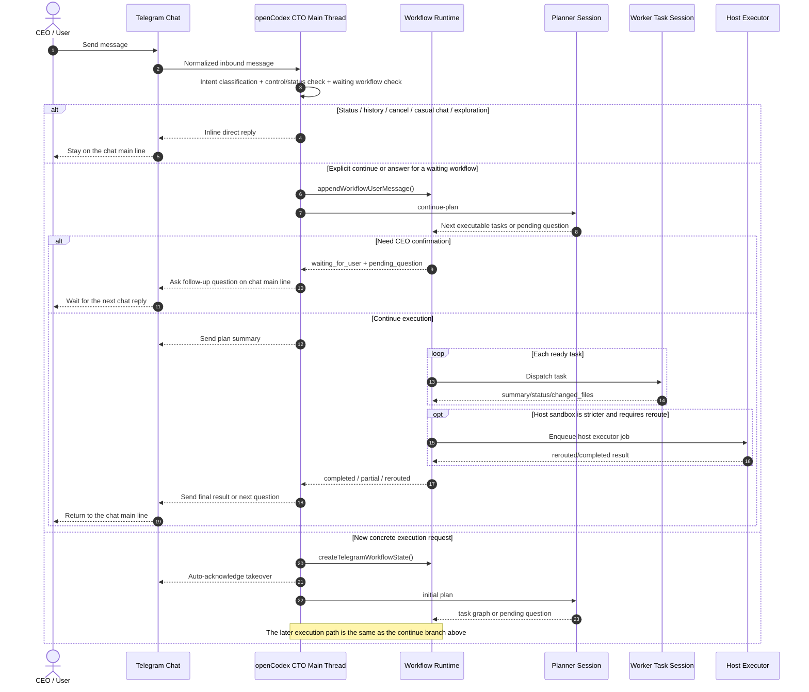

# CTO Main-Thread Sequence

## Purpose

This document captures the current Telegram CTO control-path sequence in openCodex and makes the contract explicit:

- `chat` is the only user-facing main line and the single entry point for every inbound message.
- `workflow` is derived from the `chat` main thread only when execution is needed.
- `task` is only an execution branch under a `workflow`; it never talks to the CEO directly.
- `status/history/control/casual/exploration` turns stay inline on the `chat` main line instead of spawning a workflow.

## Core Conclusion

The current implementation already mostly follows a `chat-first` model, but the repository did not have an explicit sequence document for it.

The precise model is not “a task rolls back to chat by itself.” The actual flow is:

1. The `chat` main thread receives a message and classifies the intent.
2. Only a concrete execution request spawns a `workflow`.
3. The `workflow` can fan out into one or more `task` branches.
4. Each `task` writes its result back into `workflow state`.
5. The CTO main thread reads that workflow state and sends the plan, question, or final result back to the `chat` main line.
6. The next Telegram message enters through the `chat` main-thread entry again, not through an old task.

## Sequence Diagram

## Key Constraints

### 1. The `chat` main thread is the only outward-facing identity

- The long-lived CTO identity belongs to the host supervisor, not to any sandbox child session.
- Telegram and the tray UI are only control surfaces for the same host-level CTO thread.
- Child sessions can be planners, advisors, reviewers, or workers, but they cannot replace the CEO-facing CTO identity.

### 2. `workflow` is a goal container derived from `chat`

- Each concrete execution goal creates a dedicated `cto` workflow session.
- The workflow stores `goal_text`, `latest_user_message`, `pending_question_zh`, and `tasks[]`.
- The workflow can move through `planning`, `running`, `waiting_for_user`, `completed`, `partial`, `failed`, and `cancelled`.

### 3. `task` must not take over the chat channel

- A task only executes a worker prompt and writes the result back into workflow state.
- The main thread reads those task results and decides whether to dispatch more work, ask the CEO, reroute to the host executor, or summarize back to chat.
- The real user-facing main line therefore remains `chat -> CTO main thread`, not `chat -> task`.

### 4. A waiting workflow resumes only under narrow conditions

- If a workflow is already in `waiting_for_user`, only an explicit continue or a direct answer to the pending question resumes it.
- If the user sends casual chat or exploration during that waiting period, the system preserves the workflow and replies inline on the chat main line.
- If the user sends a new concrete goal during that waiting period, the system opens a new workflow instead of forcing the message into the old task chain.

### 5. Recommended wording for the desired model

For future docs and design reviews, use this wording:

- `chat` owns the main thread and the only entry point.
- `workflow` is an execution context derived from `chat`.
- `task` is a child branch under `workflow`.
- `task` does not reply to the user directly; it rolls results back into `workflow`.
- The CTO main thread then returns those results to the `chat` main line.

This is more precise than saying “the task rolls back to chat directly,” because the workflow layer still owns state aggregation and routing decisions.

## Code Anchors

- `src/lib/cto-workflow.js`
  - `classifyTelegramCtoMessageIntent()` splits messages into `status_query / exploration / casual_chat / directive`.
  - `shouldKeepTelegramCtoInConversationMode()` keeps early vague turns in `conversation` instead of immediately creating a workflow.
  - `shouldResumeTelegramPendingWorkflow()` decides whether the next chat turn should resume a waiting workflow.
  - `buildTelegramCtoMainThreadSystemPrompt()` makes the main thread the only orchestration owner.
- `src/commands/im.js`
  - The listener loop tries `control`, then `status`, then direct reply before it enters the workflow path.
  - `handleTelegramCtoMessage()` splits between continuing an existing workflow and creating a new one.
  - `processTelegramCtoWorkflow()` plans, sends plan summaries, executes tasks, then sends either a follow-up question or a final result.
- `tests/im.test.js`
  - Covers casual chat staying inline while a waiting workflow remains untouched.
  - Covers explicit continue resuming a waiting workflow.
  - Covers a new concrete goal creating a new workflow instead of resuming the old one.
  - Covers the first vague greeting staying in conversation mode without opening a workflow.

## Recommendation

If the project wants to reinforce the `chat-first` mental model everywhere, keep reusing this sentence:

`chat owns the thread; workflow owns the goal; task owns execution; results always flow back to chat through the CTO main thread.`
