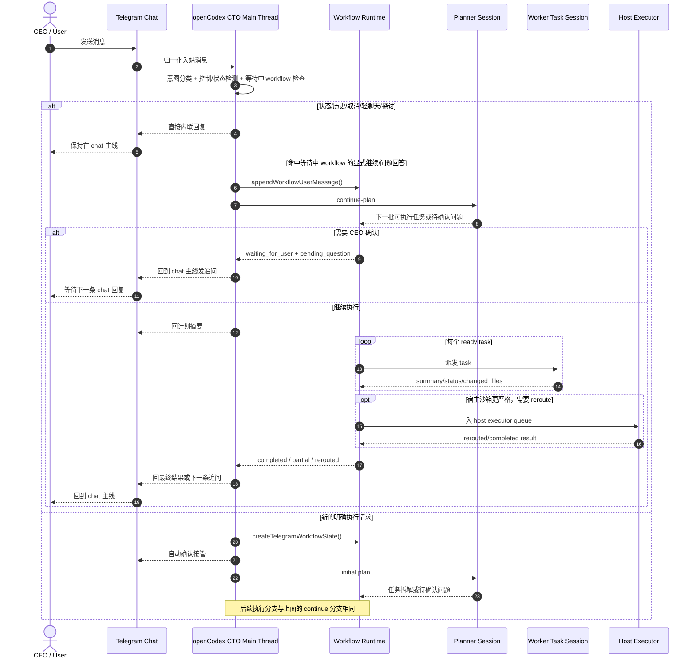

# CTO 主线程时序

## 目的

本文把 openCodex 当前 Telegram CTO 通道的真实时序整理成一份独立说明，明确以下约束：

- `chat` 是唯一对外主线，也是所有消息的统一入口。
- `workflow` 由 `chat` 主线程按需派生，用来承载一次具体执行目标。
- `task` 只是 `workflow` 的执行分支，不直接面向 CEO；任务结果必须先回写到 `workflow`，再由 `chat` 主线程统一对外回复。
- `status/history/control/casual/exploration` 这类消息优先以内联方式留在 `chat` 主线，不新建工作流。

## 主结论

当前实现已经基本符合“`chat` 为主线”的结构，但之前缺少一份显式时序图。

更准确地说，不是 `task` 自己“滚回 chat”，而是：

1. `chat` 主线程收到消息并做意图分类。
2. 只有明确执行意图才派生 `workflow`。
3. `workflow` 再拆成一个或多个 `task`。
4. 每个 `task` 的结果先回写到 `workflow state`。
5. 由 CTO 主线程读取 `workflow state`，统一把计划、追问、最终结果回送到 `chat` 主线。
6. 下一条 Telegram 消息再次从 `chat` 主线程入口进入，而不是直接进入旧 `task`。

## 时序图

## 关键约束

### 1. `chat` 主线程是唯一对外身份

- CTO 对 CEO 的长期身份归属在宿主 supervisor，而不在任何沙箱子会话中。
- Telegram 和任务栏都只是同一个宿主级 CTO 主线程的控制面。
- child session 只能作为 planner、advisor、reviewer 或 worker，不能替代 CEO-facing CTO 身份。

### 2. `workflow` 是从 `chat` 派生出的目标容器

- 每个具体执行目标会生成一个 `cto` workflow session。
- workflow 保存 `goal_text`、`latest_user_message`、`pending_question_zh` 和 `tasks[]`。
- workflow 可以进入 `planning`、`running`、`waiting_for_user`、`completed`、`partial`、`failed`、`cancelled` 等状态。

### 3. `task` 不能直接占有 chat 通道

- task 只负责执行 worker prompt，并把结果写回 workflow state。
- 主线程统一读取 task 结果，再决定继续派发、回头确认、转 host executor，还是向 chat 汇总。
- 因此真正的对外“主线”始终是 `chat -> CTO main thread`，不是 `chat -> task`。

### 4. 等待中的 workflow 只在有限条件下恢复

- 若 workflow 已处于 `waiting_for_user`，只有“显式继续”或“直接回答 pending question”才会续跑。
- 如果用户在等待期间发的是轻聊天或探讨消息，系统会保留原 workflow 不动，只在 chat 主线内联回复。
- 如果用户在等待期间发的是一个新的明确目标，则会新开 workflow，而不是强行塞回旧任务链。

### 5. “task 动态回滚 chat 主线”的推荐表达

建议在后续讨论和设计中统一使用下面的表述：

- `chat` 是主线程和唯一入口。
- `workflow` 是由 `chat` 派生出的执行上下文。
- `task` 是 `workflow` 的子分支。
- `task` 不直接回用户，而是把状态和结果回卷到 `workflow`。
- `workflow` 再由 CTO 主线程把结果回送到 `chat` 主线。

这比“task 直接滚回 chat”更准确，因为中间还有一层 workflow state 汇总与调度决策。

## 代码锚点

- `src/lib/cto-workflow.js`
  - `classifyTelegramCtoMessageIntent()` 负责把消息分成 `status_query / exploration / casual_chat / directive`。
  - `shouldKeepTelegramCtoInConversationMode()` 负责把首轮模糊消息留在 `conversation` 而不是直接开 workflow。
  - `shouldResumeTelegramPendingWorkflow()` 负责判断等待中的 workflow 是否应该被下一条 chat 恢复。
  - `buildTelegramCtoMainThreadSystemPrompt()` 明确主线程拥有唯一编排权。
- `src/commands/im.js`
  - listener 主循环先尝试 `control`、再尝试 `status`、再尝试 direct reply，只有都不命中时才进入 workflow 执行路径。
  - `handleTelegramCtoMessage()` 在“继续旧 workflow”和“新建 workflow”之间做分流。
  - `processTelegramCtoWorkflow()` 负责计划、发计划摘要、执行任务、回追问或发最终结果。
- `tests/im.test.js`
  - 覆盖“轻聊天不续跑等待中的 workflow”。
  - 覆盖“显式继续会恢复等待中的 workflow”。
  - 覆盖“新的明确目标会新开 workflow，而不是恢复旧 workflow”。
  - 覆盖“首轮寒暄留在 conversation mode，不新开 workflow”。

## 建议

如果后续还要继续强化“chat 主线”心智模型，建议所有相关文档统一采用下面一句话：

`chat owns the thread; workflow owns the goal; task owns execution; results always flow back to chat through the CTO main thread.`
